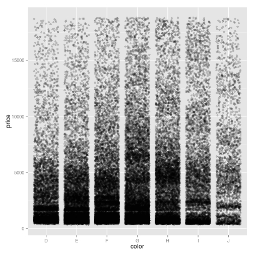

这一章主要介绍了在 **R** 中最基本的元素：数据。前段时间我在网上看到一个帖子（暂时忘记在哪里找到了），强调「data science」的重心不是在前面的那个「data」，而是后面的「science」。这是因为随着互联网的深入发展，我们现在不再是缺乏数据，反而是面临着「big data」造成的「information rich」（信息冗余）的困扰。因此，今后的数据科学应当更进一步的发展新的理论与方法来解决大数据分析。

好了，这个扯远了。不过在 **R** 中，我们最紧要的事情就是：给了一大箩筐的数据，可能是排列完整的，不过大多数情况下是混乱不堪的，要求对这些数据做统计分析与可视化工作。这个基本上是一件既头疼又心烦的苦差事。首先的任务是，先对这些数据做一定格局的处理，得到我们后续需要使用的信息变量。因此，熟练掌握处理数据的基本方法，对未来的分析至关重要。

## 概览

Wickham 用一张表格总结了 **R** 中的数据结构
> R's base data structures are summarised in the table below, organised by their dimensionality and whether they're homogeneous (all contents must be of the same type) or heterogeneous (the contents can be of different types):

 |    | Homogeneous   | Heterogeneous |
 |----|---------------|---------------|
 | 1d | Atomic vector | List          |
 | 2d | Matrix        | Data frame    |
 | nd | Array         |               |

需要解释的是标量（scalar）。什么是标量呢？就是一个个单独的变量，如

```r
x <- 5
y <- "scalar"

x
```

```
## [1] 5
```

```r
y
```

```
## [1] "scalar"
```

**R** 默认地将标量识别为 1*1 的向量（vector），也就是 0-dimensional。

> 这里科普一下有关 **R** 中的面向对象的特征。也就是说， **R** 中所有的元素都可以叫做「对象」（obgect），这不仅仅是基本的数据，如向量、data frame，还包括函数（function）、环境（environment），甚至是符号（symbols）。 **R** 处理完分析后得到的就是一个对象，我们需要哪儿元素，直接提取就可以了。比如，
>
    
```r
df = data.frame(x = rnorm(100, 0, 1), y = seq(from = 1, to = 100))
result <- lm(y ~ x, data = df)
    
result
```
    
```
    ## 
    ## Call:
    ## lm(formula = y ~ x, data = df)
    ## 
    ## Coefficients:
    ## (Intercept)            x  
    ##       50.45        -2.68
```

> 得到的结果存储在 `result` 里，这个就是一个对象，等到我们需要使用其中的「子对象」时，再从中提取即可
    
```r
result$coeff
```
    
```
## (Intercept)           x 
##      50.448      -2.677
```

面向对象的编程能够提供非常灵活的数据处理结果，并且具有较高的程序维护性。这在 **R** 得到了极大的展现。

### `str()`：查看数据结构
查看数据类型可以使用命令 `str()` 

```r
str(df)
```

```
## 'data.frame':	100 obs. of  2 variables:
##  $ x: num  0.3458 -0.0375 0.1819 -0.0819 0.1932 ...
##  $ y: int  1 2 3 4 5 6 7 8 9 10 ...
```


## 向量

如上所述， **R** 中主要的一维数据类型包括 `atomic vector`（基础向量） 和 `list`（列表），前者要求罗列其中的数据均是同属性的，比如 `logical`，`interger`，`double`，和 `character`。而后者 `list` 则可以是多种数据类型的混合。

### 基础向量

基础向量是组成 **R** 编程语言的基石，可以由此构成其他类型的数据结构。怎么去理解  **R** 中的向量呢？

#### 数据的向量化

其实，这个可以看作是一个研究变量的序列观测值。比如

```r
x <- c(35.6, 36.1, 35.8, 37, 36.5, 37.2, 35.8)
str(x)
```

```
##  num [1:7] 35.6 36.1 35.8 37 36.5 37.2 35.8
```

```r
is.vector(x)
```

```
## [1] TRUE
```

这个就是一个向量，可以视为一天中在七个不同时间段的气温观测。因此，我们可以利用这个向量来产生矩阵，从而实现多元变量在不同时间序列上的观测值。其实，这种数据的向量化不仅提供了对数据的直观理解，而且还能提高 **R** 的运算速度，尽量避免使用循环，优化程序。这点我们在日后会继续讨论。

#### 生成向量的方法

用于生成向量的命令主要有：

- `c()`:即「canbinate」的意思，用于生成一个向量，并且可用于嵌套
    
    ```r
    a <- c(1, 2, 4, 6, 8)
    b <- c(1, c(2, c(4, 6.8)))  # 套嵌使用
    a == b
    ```
    
    ```
    ## Warning: longer object length is not a multiple of shorter object length
    ```
    
    ```
    ## [1]  TRUE  TRUE  TRUE FALSE FALSE
    ```
    
    ```r
    
    s <- c(1:10)  # 一个序列。相当于 seq(from = 1, to = 10, by= 1)
    s
    ```
    
    ```
    ##  [1]  1  2  3  4  5  6  7  8  9 10
    ```
    
    ```r
    
    int <- c(1L, 6L, 8L)  # 产生integer类
    
    log <- c(T, F, F, T, T)  # logical
    
    chr <- c("these", "are", "some", "character")
    ```

- `seq()`:即「sequence」的意思，主要用于产生一个带有规律的序列        
    
    ```r
    f <- seq(1:10)  # 默认的increament是1,相当于 c(1:10)
    f
    ```
    
    ```
    ##  [1]  1  2  3  4  5  6  7  8  9 10
    ```
    
    ```r
    
    g <- seq(from = 1, to = 10, by = 0.5)
    
    g
    ```
    
    ```
    ##  [1]  1.0  1.5  2.0  2.5  3.0  3.5  4.0  4.5  5.0  5.5  6.0  6.5  7.0  7.5
    ## [15]  8.0  8.5  9.0  9.5 10.0
    ```

- `rep()`:即[replecate],重复某个数或者某个「序列」，可用于产生较为复杂的数据。
    
    ```r
    h <- rep(5, 10)  # 单个数字的重复
    h
    ```
    
    ```
    ##  [1] 5 5 5 5 5 5 5 5 5 5
    ```
    
    ```r
    
    j <- rep(c(1:3), 3)  # 重复一个序列 c(1:3)
    j
    ```
    
    ```
    ## [1] 1 2 3 1 2 3 1 2 3
    ```

- `rnorm()`:产生随机数，还有其他的分布
    
    ```r
    k <- rnorm(100)  #default：rnorm(no, mean = 0, sd = 1)
    
    l <- rnorm(100, mean = 2, sd = 5)
    plot(density(l))
    ```
    
     


#### 类型与长度

`typeof()` 用于查看数据类型，而 `length()` 则用于查看向量长度：如果是一维数据，则给出长度；如果是矩阵或者 `data.frame`，则给出 `nrow` 与 `ncol` 的合计。

```r
x <- rnorm(100)
typeof(x)
```

```
## [1] "double"
```

```r
length(x)
```

```
## [1] 100
```

```r

y <- c("first", "second", "third")
typeof(y)
```

```
## [1] "character"
```

```r
length(y)
```

```
## [1] 3
```

```r

z <- c(T, T, F)
typeof(z)
```

```
## [1] "logical"
```

```r
length(z)
```

```
## [1] 3
```

```r

w <- seq(from = 1, to = 10, by = 1)
typeof(w)
```

```
## [1] "double"
```

```r
length(w)
```

```
## [1] 10
```

```r

mat <- matrix(rnorm(20), nrow = 4, ncol = 5)
typeof(mat)
```

```
## [1] "double"
```

```r
length(mat)
```

```
## [1] 20
```


### `list`:列表

我们已经知道，`vector`是用于同种类型属性的数据，而`list`则适用于不同类型的数据，可以说是各种数据的一个「大火锅」。我们使用`list()`来生成数据，不是之前介绍的`c()`。

```r
u <- list(1:3, "cha", T, F, c(1, 4, 7), rep(1, 3), seq(1:5))

u
```

```
## [[1]]
## [1] 1 2 3
## 
## [[2]]
## [1] "cha"
## 
## [[3]]
## [1] TRUE
## 
## [[4]]
## [1] FALSE
## 
## [[5]]
## [1] 1 4 7
## 
## [[6]]
## [1] 1 1 1
## 
## [[7]]
## [1] 1 2 3 4 5
```

```r
str(u)
```

```
## List of 7
##  $ : int [1:3] 1 2 3
##  $ : chr "cha"
##  $ : logi TRUE
##  $ : logi FALSE
##  $ : num [1:3] 1 4 7
##  $ : num [1:3] 1 1 1
##  $ : int [1:5] 1 2 3 4 5
```

```r
typeof(u)
```

```
## [1] "list"
```

当然，`list`也可以跟`c()`一样实现套嵌(Wickham称之为[recursive])

```r
v <- list(list(2, 4, T, "nope", seq(4:8)), rep(3:4, 2), list(T, F, "yes"))
v
```

```
## [[1]]
## [[1]][[1]]
## [1] 2
## 
## [[1]][[2]]
## [1] 4
## 
## [[1]][[3]]
## [1] TRUE
## 
## [[1]][[4]]
## [1] "nope"
## 
## [[1]][[5]]
## [1] 1 2 3 4 5
## 
## 
## [[2]]
## [1] 3 4 3 4
## 
## [[3]]
## [[3]][[1]]
## [1] TRUE
## 
## [[3]][[2]]
## [1] FALSE
## 
## [[3]][[3]]
## [1] "yes"
```

```r

str(v)
```

```
## List of 3
##  $ :List of 5
##   ..$ : num 2
##   ..$ : num 4
##   ..$ : logi TRUE
##   ..$ : chr "nope"
##   ..$ : int [1:5] 1 2 3 4 5
##  $ : int [1:4] 3 4 3 4
##  $ :List of 3
##   ..$ : logi TRUE
##   ..$ : logi FALSE
##   ..$ : chr "yes"
```

```r
typeof(v)
```

```
## [1] "list"
```


